# PetNexus Backend Architecture Map

Audit date: 2026-07-14  
Source of truth: current repository code.

## Repository folder map

```text
petnexus-backend/
├─ cmd/
│  └─ api/
│     └─ main.go                  # startup, dependency construction, router boot
├─ internal/
│  ├─ config/                     # env + godotenv config loading
│  ├─ database/                   # PostgreSQL connection, ping, startup migrations
│  ├─ dto/                        # request/response API shapes
│  ├─ handlers/                   # HTTP binding and response translation
│  ├─ middleware/                 # JWT auth and role guard middleware
│  ├─ models/                     # GORM models and constants
│  ├─ repositories/               # GORM/raw SQL database access
│  ├─ routes/                     # route registration and dependency bundle
│  ├─ services/                   # validation, ownership, business rules, response mapping
│  └─ utils/                      # response helpers, AppError, JWT, bcrypt, public pet ID
├─ migrations/                    # manual SQL equivalents of startup migrations
├─ docs/                          # implementation docs, progress logs, sprint summaries
├─ docker-compose.yml             # local PostgreSQL
├─ go.mod / go.sum
└─ README.md
```

Future-only placeholders exist for QR, authorization, visits, timeline, notifications, audit logs, and clinic staff. They are not wired into routes and should not be treated as implemented features.

## Startup flow

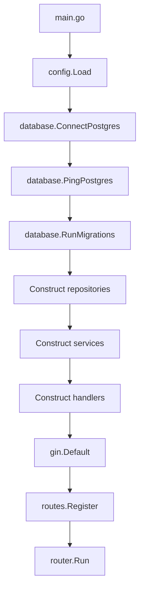

Text explanation:

- `config.Load` reads `.env` when present, then environment variables.
- `ConnectPostgres` prefers `DATABASE_URL`; otherwise it builds a local `DB_*` DSN.
- `RunMigrations` executes guarded SQL steps before any route serves traffic.
- Dependency construction is manual and centralized in `cmd/api/main.go`.

## Dependency construction flow

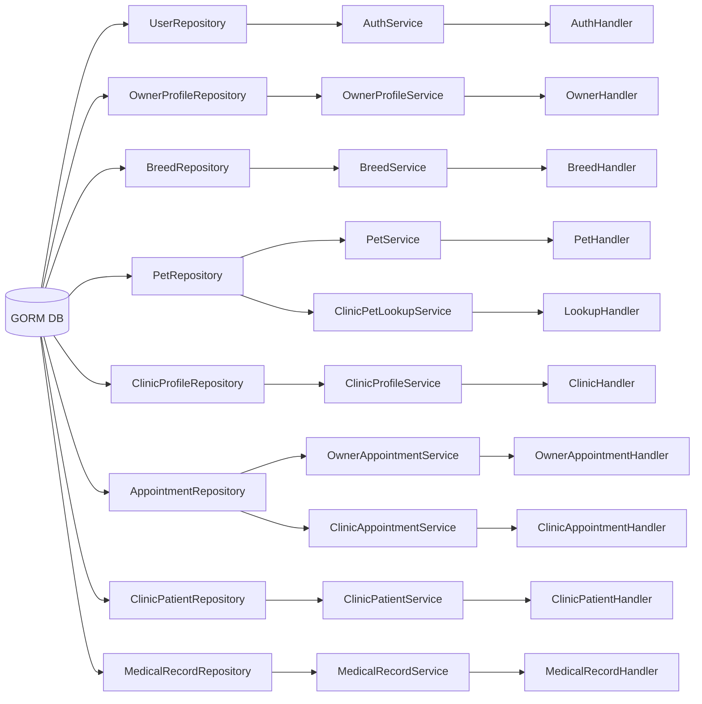

## Route registration flow

Routes are registered in `internal/routes/routes.go`.

```text
GET /health
GET /health/db

/api/auth
  POST /register
  POST /login

/api/me
  AuthMiddleware

/api/owner
  AuthMiddleware
  RequireRole(owner)
  POST  /profile
  GET   /profile
  PATCH /profile
  POST  /appointments
  GET   /appointments
  GET   /appointments/:id
  PATCH /appointments/:id/cancel

/api/breeds
  GET public

/api/pets
  AuthMiddleware
  RequireRole(owner)
  POST  /
  GET   /
  GET   /:id
  PATCH /:id

/api/clinic
  AuthMiddleware
  RequireRole(clinic, clinic_staff)
  POST  /profile
  GET   /profile
  PATCH /profile
  GET   /pet-lookup
  GET   /patients
  GET   /patients/:petId
  POST  /patients/:petId/medical-records
  POST  /appointments
  GET   /appointments
  GET   /appointments/:id
  PATCH /appointments/:id/status
  PATCH /appointments/:id/cancel
  GET   /medical-records
  GET   /medical-records/:recordId
  PATCH /medical-records/:recordId
```

## Authentication middleware flow

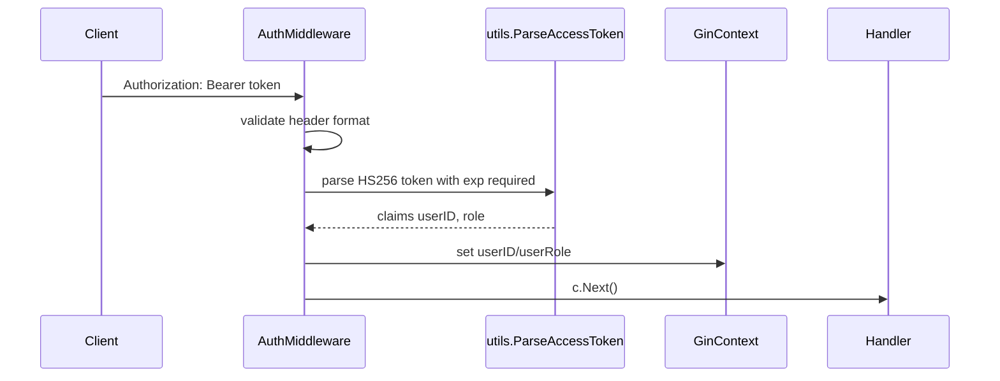

Role middleware flow:

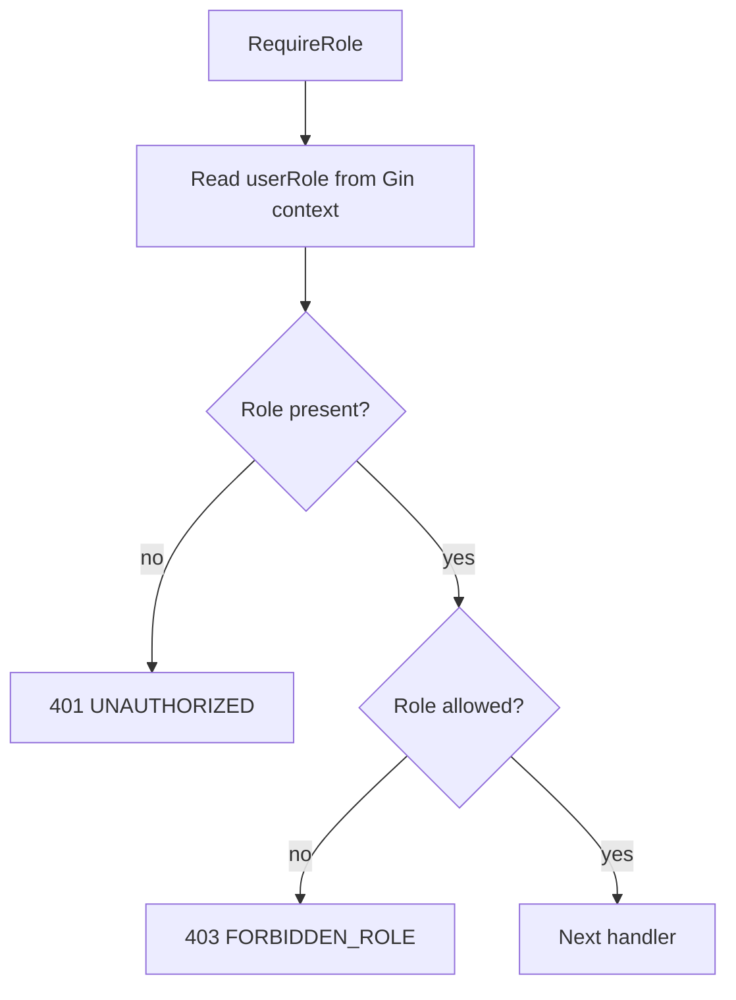

## Handler -> Service -> Repository -> Database flow

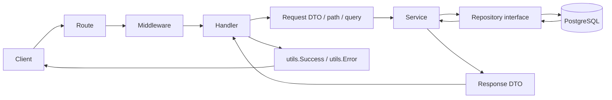

Responsibility split:

- Handler: parse input and translate errors.
- Service: validate input, resolve JWT-owned profile, enforce business rules.
- Repository: execute database queries and map GORM errors to repository errors.
- Database: enforce schema constraints and indexes.

## Table relationships

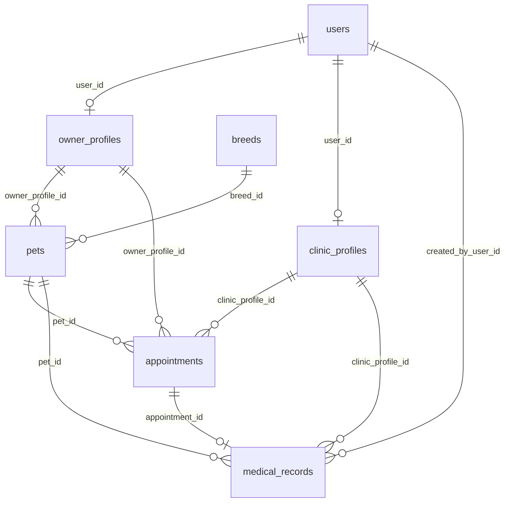

Important derived relationship:

```text
Clinic patient =
unique appointments.pet_id
where appointments.clinic_profile_id = current clinic profile
and appointments.status <> 'cancelled'
```

There is no separate `patients` table.

## Full request flow: Login

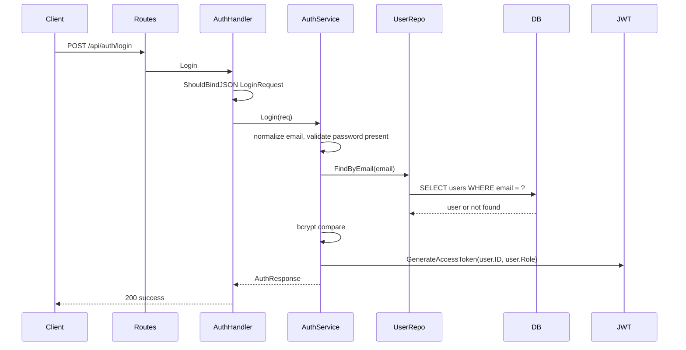

Flow details:

- Route: `POST /api/auth/login`
- Middleware: none
- Handler: `AuthHandler.Login`
- Request DTO: `dto.LoginRequest`
- Service: `authService.Login`
- Repository: `UserRepository.FindByEmail`
- Models/tables: `models.User`, `users`
- Response DTO: `dto.AuthResponse`
- Error path: invalid JSON 400; missing email/password 422; bad credentials 401; unexpected DB/JWT error 500.

## Full request flow: Create Pet

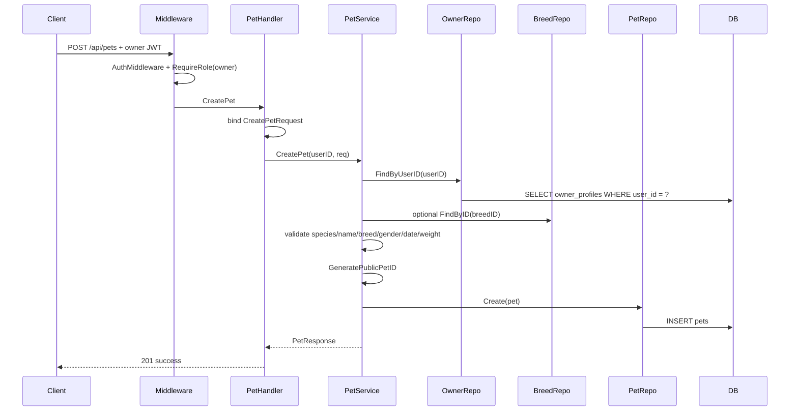

Flow details:

- Route: `POST /api/pets`
- Middleware: `AuthMiddleware`, `RequireRole(owner)`
- Handler: `PetHandler.CreatePet`
- Request DTO: `dto.CreatePetRequest`
- Service: `petService.CreatePet`
- Repositories: owner profile, breed, pet
- Models/tables: `owner_profiles`, `breeds`, `pets`
- Response DTO: `dto.PetResponse`
- Error path: 400 invalid body/validation; 401 unauthenticated; 403 wrong role; 404 missing owner profile or breed; 500 unexpected DB/randomness.

## Full request flow: Create Owner Appointment

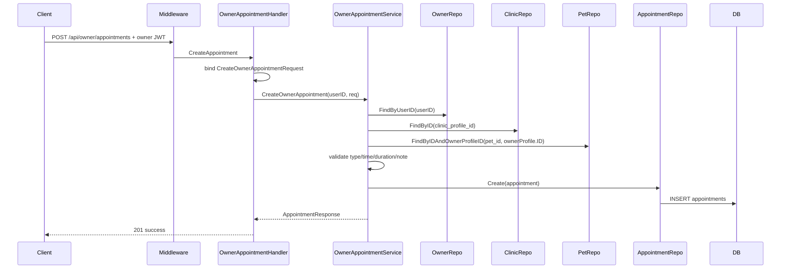

Flow details:

- Route: `POST /api/owner/appointments`
- Middleware: `AuthMiddleware`, `RequireRole(owner)`
- Handler: `OwnerAppointmentHandler.CreateAppointment`
- Request DTO: `dto.CreateOwnerAppointmentRequest`
- Service: `ownerAppointmentService.CreateOwnerAppointment`
- Repositories: owner profile, clinic profile, pet, appointment
- Models/tables: `owner_profiles`, `clinic_profiles`, `pets`, `appointments`
- Response DTO: `dto.AppointmentResponse`
- Error path: invalid UUID/body/time/type/duration 400; missing owner profile/clinic/pet 404; wrong role 403; unexpected DB 500.

## Full request flow: List Clinic Patients

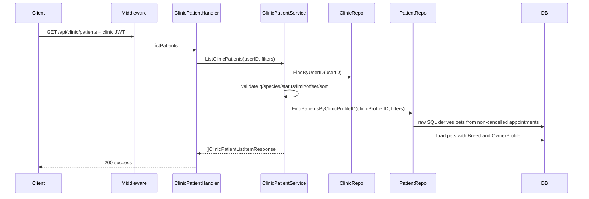

Flow details:

- Route: `GET /api/clinic/patients`
- Middleware: `AuthMiddleware`, `RequireRole(clinic, clinic_staff)`
- Handler: `ClinicPatientHandler.ListPatients`
- Request DTO/filter: `dto.ClinicPatientFilters`
- Service: `clinicPatientService.ListClinicPatients`
- Repository: `ClinicPatientRepository.FindPatientsByClinicProfileID`
- Models/tables: `appointments`, `pets`, `owner_profiles`, `breeds`, `clinic_profiles`
- Response DTO: `dto.ClinicPatientListItemResponse`
- Error path: invalid query 400; missing auth 401; owner role 403; missing clinic profile 404; DB error 500.

## Full request flow: Create Medical Record

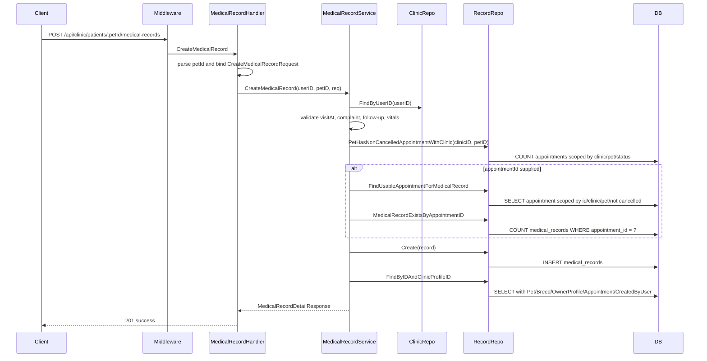

Flow details:

- Route: `POST /api/clinic/patients/:petId/medical-records`
- Middleware: `AuthMiddleware`, `RequireRole(clinic, clinic_staff)`
- Handler: `MedicalRecordHandler.CreateMedicalRecord`
- Request DTO: `dto.CreateMedicalRecordRequest`
- Service: `medicalRecordService.CreateMedicalRecord`
- Repositories: clinic profile, medical record
- Models/tables: `clinic_profiles`, `appointments`, `medical_records`, `pets`, `owner_profiles`, `users`
- Response DTO: `dto.MedicalRecordDetailResponse`
- Error path: invalid pet ID/body/date/vitals 400; unauthenticated 401; wrong role 403; missing clinic profile/patient/appointment 404; duplicate appointment medical record 409; unexpected DB 500.

## Ownership enforcement map

| Rule | Enforcement location |
| --- | --- |
| Owner can access only own profile | owner route role middleware; `OwnerProfileService` resolves `owner_profiles.user_id` from JWT |
| Owner can access only own pets | owner route role middleware; `PetService.findCurrentOwnerProfile`; `PetRepository.FindByIDAndOwnerProfileID` |
| Owner can use only own pets in appointments | `OwnerAppointmentService.CreateOwnerAppointment`; `PetRepository.FindByIDAndOwnerProfileID` |
| Clinic can access only own profile | clinic route role middleware; `ClinicProfileService` resolves `clinic_profiles.user_id` from JWT |
| Clinic can manage own appointments | `ClinicAppointmentService.currentClinicProfile`; `AppointmentRepository.FindByIDAndClinicProfileID` |
| Clinic patients scoped to current clinic | `ClinicPatientService.currentClinicProfile`; raw SQL filters `appointments.clinic_profile_id` |
| Clinic can read/update own medical records | `MedicalRecordService.currentClinicProfile`; `MedicalRecordRepository.FindByIDAndClinicProfileID` and scoped `Update` |
| Clinic cannot create medical records for unrelated pets | `MedicalRecordService.ensureClinicPatient`; repository counts non-cancelled appointments by clinic/pet |
| Appointment-linked medical records validate pet and clinic | `MedicalRecordService.ensureUsableAppointment`; repository filters by appointment ID, clinic ID, pet ID, and non-cancelled status |
| Immutable medical record ownership fields cannot be patched | `dto.UpdateMedicalRecordRequest` omits ownership fields; `MedicalRecordRepository.Update` uses explicit update map |
